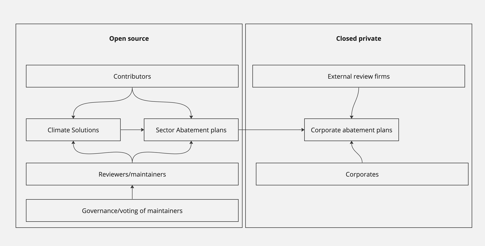
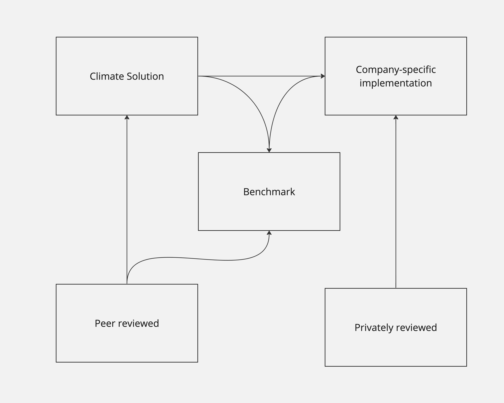
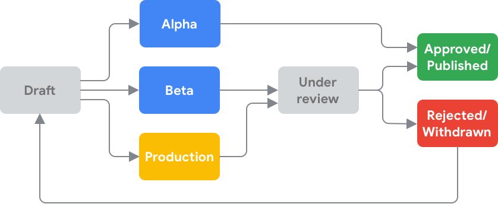

# Project Structure

1. **Open Source:** Our framework involves developing plans that are created collectively with contributions from the global community. This democratic approach encourages the collective intelligence of global expertise to create the most effective and innovative solutions.
2. **Closed Private:** While we champion a transparent process, we also recognize the importance of confidentiality. Certain parts of the process may, therefore, remain private to safeguard sensitive business information.
3. **Contributors:** We welcome inputs from anyone - independent researchers, environmentalists, data scientists, etc., who can contribute to the development of our climate solutions and abatement plans.
4. **External Review Firms:** Independent external review firms play a crucial role in unbiasedly assessing the corporations' progress against our plans, maintaining confidentiality and ensuring best practices are followed.
5. **Climate Solutions:** Our objective is to offer tangible, absolute solutions to combat climate change. We focus on enabling sustainable transformations across sectors.
6. **Sector Abatement Plans:** These are guidelines developed collaboratively for specific industrial sectors to reduce their greenhouse gas emissions effectively and transition towards greener practices.
7. **Corporate Abatement Plans:** We devise customized strategies for specific businesses, assisting them to reduce their carbon footprint efficiently and responsibly.
8. **Reviewers/Maintainers:** These are caretakers of our process. They monitor the contributions, maintain the quality of the solutions, and ensure the plans are updated with the latest technological advancements and findings.
9. **Corporates:** The companies that will implement these plans, contributing to their sustainability targets, positively impacting their reputation and making a genuine difference in mitigating climate change.
10. **Governance/Voting of Maintainers:** We believe in a democratic process. Decisions regarding the selection or rotation of maintainers will be determined through a fair voting process.

# Detailed structure

We are inspired by the open source community and how modern software libaries are released.  

1. Climate solutions are added in a organized libary by anyone.
    1. Peer reviewed and vetted
2. Benchmarks use climate solutions for each industry/section 
3. Users can review benchmarks and implement climate solutions from solution library.

# Climate solutions process

Similar to software, we all new solutions will go into Alpha stage, then mature into Beta and then into production.  This will enable companies to understand which solutions are avaiable based on their risk tolerance.

Image: from [google developers](https://developers.google.com/assistant/console/releases)

The thought process here is every solution maybe very experimental in the early days but show promise. This makes it clear to end users.

## Meaning of ratings:

### Alpha

solution is heavily actively being developed and outcome may not be consisent. 

### Beta

Solution is believed to be reproducable in various enviroments with consisent outcomes.

### Production

Solution has demostrated consisent outcomes and can be deployed globally with very little implementation and outcome risk.

### Promotion Review process

TBD. We will need to find a set of reviewers who are community voted and community will decide their goverence process.